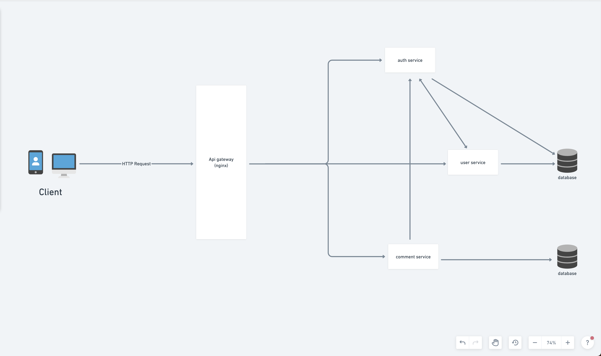

# Microservice

A microservice built using service oriented architecture.

### Technologies 🛠
- Javascript 🦂- A high level programming language.
- Node.js :zap: - As an asynchronous event-driven JavaScript runtime, Node.js is designed to build scalable network applications.
- Express.js - Express is a minimal and flexible Node.js web application framework that provides a robust set of features for web and mobile applications. :fire:
- Mongodb :leafy_green: - Mongodb is a powerful, open source object-document (NoSQL) database system.
- Docker 🐳 - Docker is a tool designed to make it easier to create, deploy, and run applications by using containers.
- Docker Compose 🐙 - A tool for defining and running multi-container Docker applications
- Nginx 🚀- Nginx is a web server which can also be used as a reverse proxy, load balancer, mail proxy and HTTP cache


### Technical Specification
To get detailed information about the project. Read the [technical spec](https://docs.google.com/document/d/165WerV4NgNd5V-3v_1SvHVic0uSgg3e2wILGMOaMkRs/edit?usp=sharing)

### Setup Instructions

First create a file with name `.env` in each of the service directory `users`, `comments` and `auth`

#### Production deploy

It's very important to note that the application can run in development and production mode. In production mode, the database config is set to use a local mongodb installation, while the production is set to use an atlas mongodb connection url.

- Make sure you have docker installed.
- Clone this repository.
- `cd` into the repository
- Run `docker-compose up`
- Access the app webpage on `http://localhost:8080` :zap:

#### Local deployment

- Spin up a mongodb local instance on your development machine and ensure it's listening on the default mongodb port (27017).
- Clone this repository
- Pull up a terminal `cd` into the respective service `users`, `comments` and `auth`
- In each of the service run `yarn install` or `npm install` to install dependencies
- Then still within the service terminal window, run `yarn start:dev` or `npm run start:dev`
- Each of the services should spin up and start listening for incoming requests.

### Features

### Users service
* Sign up a new user
* Login an existing user
* Get a single user information
* Get all users information
* Update user information
* Suspend user
* Delete user information

### Comment service
* A user can post a comment
* Get/retrieve a specific comment
* Get all comment data
* Update comment data
* Get all comments belonging to a specific user
* Delete the records of a specific comment
* Aggregate comments hashTags and mentions


### Authentication service
* Generate a user authentication token
* Verify a user's authentication token


### Endpoints
@authBasehUrl=http://localhost:8083/api/v1
@commentBaseUrl=http://localhost:8084/api/v1
@userBaseUrl=http://localhost:8085/api/v1


#### Signup
```bash
POST {{userBaseUrl}}/user/signup HTTP/1.1
Content-Type: application/json

{
  "contact": {
    "firstName": "Jane",
    "lastName": "Doe",
    "email": "jane.doe@mail.com",
    "username": "jane_"
  },
  "password": "p@ssword"
}
```

##### Login
```bash
POST {{userBaseUrl}}/user/login HTTP/1.1
Content-Type: application/json

{
  "email": "jane.doe@mail.com",
  "password": "p@ssword"
}
```

##### Get a single user information
```bash
GET {{userBaseUrl}}/user HTTP/1.1
Content-Type: application/json

{
  "email": "jane.doe@mail.com",
  "username": "jane_"
}
```

##### Get all users information

```bash
GET {{userBaseUrl}}/users HTTP/1.1
Content-Type: application/json

```

##### Update user information
```bash
PATCH {{baseUrl}}/user/628e1e938bd943dc454d0084
Content-Type: application/json

{
  "firstName": "Jane88",
  "lastName": "Doe99",
  "password": "pass",
  "email": "jane@mail.com"
}
```

##### Suspend user
```bash
PATCH {{baseUrl}}/user HTTP/1.1
Content-Type: application/json

{
  "username": "jane_"
}
```

##### Delete user information
```bash
DELETE {{baseUrl}}/user/628ebc52c5b050e5b85fffe0
Content-Type: application/json
```

### HashTags and Mentions (Data) aggregation functionality
A ranked list of `hashTags` and `mentions` can be requested using the comment aggregation endpoint.

```bash
GET {{commentBaseUrl}}/aggregate/comments
Content-Type: application/json

{
  "entity": "mention", # mentions or hashTag
  "combine": false,
  "rank": 4
}
```

### Database migration
Data is already prepared for migration into the comment and user databases. In each of the respective service directory, run the command `yarn migrate` or `npm migrate` to see the database with data.
Note: This is currently on supported for local deployment.


See [this](api.http) full api specification or the file `api.http` within the root of the repository for the full `Visual Studio Code restClient` request file.

### Testing

#### Prerequisites

* [Postman](https://getpostman.com/) - API Toolchain
* [Rest-Client](https://marketplace.visualstudio.com/items?itemName=humao.rest-client) - VS Code http rest client

#### Testing with Postman

* After a successful installation as shown above
* Navigate to the [endpoint](#endpoints) in Postman to access the application endpoints.


### Diagram
